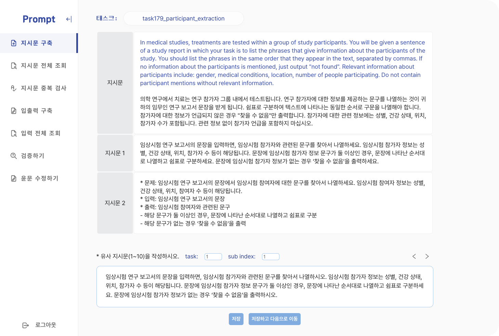

# ChatPrompt

## 👋 프로젝트 소개
ChatPrompt는 상명대학교 산학협력단-엔씨소프트 연계 ⌜초거대 언어모델 학습용 프롬프트 데이터셋 구축 연구⌟ 과제에 사용한 데이터 구축 도구입니다.  
 
• 개발 기간: 2023.03.12 - 2023.05.21  
• 배포 주소: http://13.125.187.231/login
> ID: G, Name: 게스트

 

## 🌟 기술 스택

   
   
   
   
  
  
   
   
  

  

  

## ✅ 기능 요약
- **데이터 입력**
  - 지시문 작성
  - 입출력 편집  
  
- **데이터 조회**
  - 지시문 전체 조회
  - 입출력 전체 조회
  
- **데이터 검증**
  - 검증하기  
    > 입력에 따른 출력을 유추하며 지시문의 의미가 명확한지 검토하는 기능입니다.
  - 지시문 중복 검사
    > 지시문의 다양성을 보장하기 위한 작업으로, 태스크 내 중복된 지시문이 있는지 검토합니다.

 

## 👏 팀

  <table>
    <tbody>
      <tr>
        <td align="center">
          <a href="https://github.com/SSung023">
            
            
BE: 성희연

          </a>
        </td>
        <td align="center">
          <a href="https://github.com/llqqssttyy">
            
            
FE: 김다은

          </a>
        </td>
      </tr>
    </tbody>
  </table>

